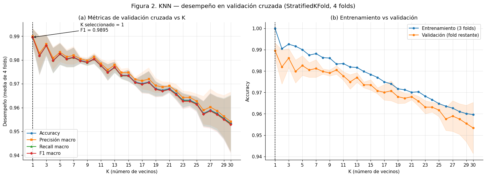
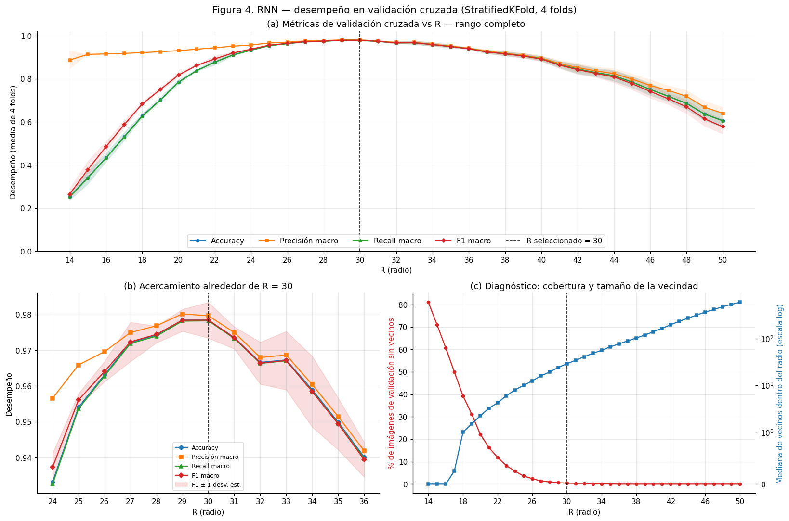

# Taller 07 — Clasificadores KNN y RNN (dataset `digits`)

**Inteligencia Artificial — ELP 8012 — Universidad del Norte**
Programa de Ingeniería de Sistemas · Profesor: Eduardo Zurek, Ph.D. · Evaluación 2

| Integrante | Código |
|---|---|
| Maria Ordoñez | 200169828 |
| Jhonayker Echeverria | 200181127 |
| Franklin Amador | 200180542 |

## Contenido

| Archivo | Descripción |
|---|---|
| `Taller07_KNN_RNN_digits.ipynb` | Cuaderno de Jupyter con la solución completa, ya ejecutado y con todas las salidas |
| `figuras/` | Figuras generadas por el cuaderno |
| `requirements.txt` | Dependencias |

## Qué se hizo

1. Dataset `digits` de scikit-learn: 1797 imágenes de 8×8 píxeles (64 características) y 10 clases.
2. Partición estratificada **80 % entrenamiento / 20 % prueba** (1437 / 360).
3. **Validación cruzada `StratifiedKFold` con 4 folds** sobre el entrenamiento para elegir los hiperparámetros.
4. **KNN** (`KNeighborsClassifier`, distancia euclidiana): se evalúa **K = 1…30** con accuracy, precisión, recall y F1 macro.
5. **RNN** (`RadiusNeighborsClassifier`, distancia euclidiana): se evalúa **R = 14…50**. El rango se definió a partir de la distribución de distancias entre imágenes.
6. Criterio de selección: mayor **F1 macro** medio en validación cruzada (desempate por accuracy).
7. Evaluación final, una sola vez, sobre el 20 % de prueba.

## Resultados

| Modelo | Hiperparámetro | F1 macro (CV, 4 folds) | Accuracy (prueba) | F1 macro (prueba) |
|---|---|---|---|---|
| KNN | **K = 1** | 0.9895 ± 0.0036 | 0.9861 | 0.9859 |
| RNN | **R = 30** | 0.9784 ± 0.0050 | 0.9722 | 0.9716 |




## Cómo ejecutar

```bash
pip install -r requirements.txt
jupyter notebook Taller07_KNN_RNN_digits.ipynb
```

También se puede abrir en Google Colab. El cuaderno no necesita archivos externos, porque el dataset viene incluido en scikit-learn. La ejecución completa tarda menos de un minuto.
